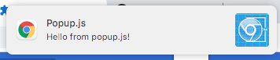

# Chrome notifications example
A primitive chrome extension that shows a browser notification on clicking an icon.

It contains a working answer for https://stackoverflow.com/questions/60583659/cant-get-notifications-to-work-on-google-chrome-extension

How to use:
- Open chrome://extensions/
- Enable developer mode
- Click 'Load unpacked'
- Target this folder and load it
- Find a new icon in your browser extensions list and click on it
- Chrome notification should appear in the right top corner

